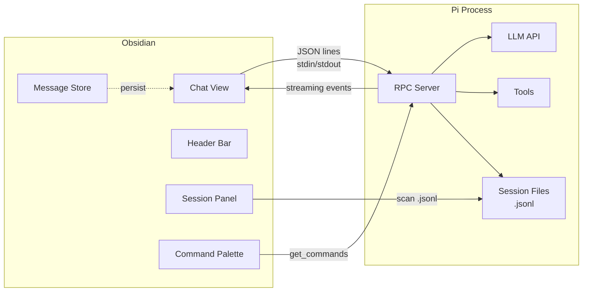

# Pi Plugin for Obsidian

Chat with the [Pi coding agent](https://github.com/nicholasgasior/pi-coding-agent) inside Obsidian. Conversations render as native Obsidian markdown with full support for code highlighting, Mermaid diagrams, callouts, and wiki-links.

> **Desktop only.** Requires Pi installed locally (`npm i -g @mariozechner/pi-coding-agent`).

## Features

### Chat View
- Full streaming with live markdown rendering
- Thinking blocks (expandable, auto-collapses when response starts)
- Tool call results in collapsible details
- Steering messages — send while the agent is working to redirect it
- Abort button to cancel mid-stream
- Image paste support (base64)
- File attachment via `@` picker

### Session Management
- **Header bar** — shows session name (click to rename), model, thinking level, and working directory
- **Session sidebar** — browse, search, switch, delete, and export Pi's native `.jsonl` sessions
- **Message persistence** — chat history survives session switches and plugin restarts
- **Auto-save** — conversations saved as markdown notes to your vault on close
- **New Session** button with auto-save of current conversation

### Command Integration
- `/` in chat input opens a command picker with Pi's available commands
- Pi commands registered in Obsidian's command palette (`Ctrl+P` → `Pi: /command-name`)
- Commands grouped by source (skill, extension, prompt template)
- Commands re-fetched per connection (project-scoped)

### Model Switching
- `Pi: Switch model` command to pick from available models
- Model and thinking level shown in header and status bar

### Status Bar
- Session name, model, token usage, and cost at a glance
- Streaming indicator

## Setup

1. Install [Pi](https://github.com/nicholasgasior/pi-coding-agent) globally
2. Clone or download this repo
3. `npm install && npm run build`
4. Copy `main.js`, `styles.css`, and `manifest.json` to your vault's `.obsidian/plugins/pi-plugin/`
5. Enable "Pi" in Obsidian → Settings → Community Plugins

### Settings

| Setting | Default | Description |
|---------|---------|-------------|
| Pi binary path | `pi` | Path to the Pi executable |
| Working directory | vault root | Working directory for Pi |
| Default provider | (Pi default) | LLM provider (anthropic, openai, google, etc.) |
| Default model | (Pi default) | Model name |
| Session save directory | `Pi-Sessions` | Vault directory for saved conversations |
| Persist sessions | `true` | Auto-save conversations as vault notes |
| Thinking level | `medium` | Reasoning level (none, low, medium, high) |

## Architecture

The plugin communicates with Pi via its [RPC mode](https://github.com/nicholasgasior/pi-coding-agent/blob/main/docs/rpc.md) — spawns `pi --mode rpc --no-session` and exchanges JSON lines over stdin/stdout.



### Key Modules

| File | Purpose |
|------|---------|
| `src/rpc.ts` | Spawn Pi process, JSON line protocol, request/response correlation |
| `src/view.ts` | Chat view — header, messages, input, session panel integration |
| `src/stream-handler.ts` | Process RPC events into ChatMessages (text deltas, tool calls, thinking) |
| `src/renderer.ts` | Render messages as Obsidian markdown |
| `src/session-scanner.ts` | Read Pi's native `.jsonl` session files |
| `src/session-panel.ts` | Session browser sidebar |
| `src/message-store.ts` | Persistent message cache for session history |
| `src/commands.ts` | `/` command suggest and palette registration |
| `src/input.ts` | Chat input with auto-resize, paste, attachments |
| `src/sessions.ts` | Save/load conversations as markdown vault notes |
| `src/statusbar.ts` | Status bar with model, tokens, cost |
| `src/settings.ts` | Plugin settings |

## Development

```bash
npm install
npm run dev    # watch mode
npm run build  # production build with type checking
```

Build output is `main.js` in the repo root. Copy it (along with `styles.css` and `manifest.json`) to your vault's plugin directory to test.

## License

MIT
